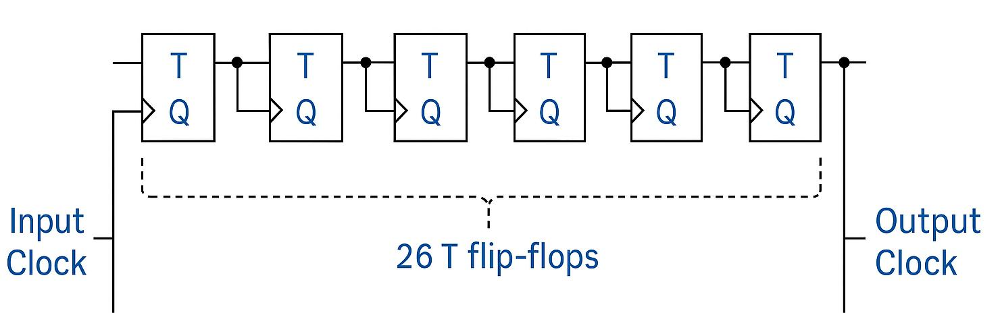
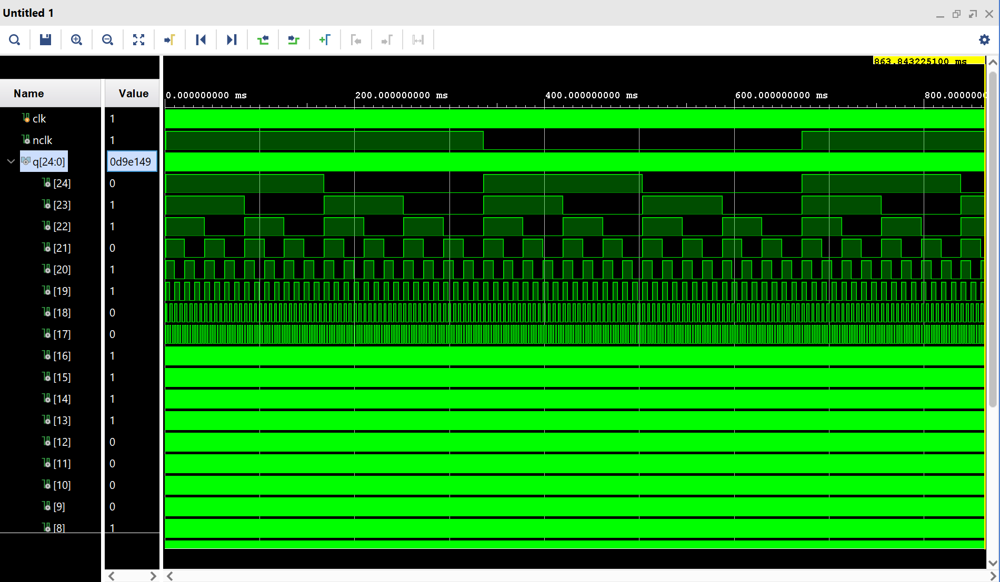

# Frequency Divider

This project implements a digital frequency divider using Verilog on the Basys 3 FPGA board.

### 2. Block Diagram

## Design Overview
- **Input Clock:** 100 MHz (Basys 3 onboard oscillator)
- **Output Clock:** ~1 Hz
- **Implementation:** 26 cascaded T flip-flops
- **T Flip-Flop Design:** Built using Xilinx `FDRE` primitive and a XOR gate.

## Output Waveforms

### 1. Frequency Divider Output

## How It Works
- Each T flip-flop toggles on the rising edge of its clock.
- Cascading 26 T flip-flops achieves a clock division of approximately 2^26 (~67 million), reducing 100 MHz to about 1.49 Hz.

## Tools Used
- Xilinx Vivado
- Basys 3 FPGA Board
